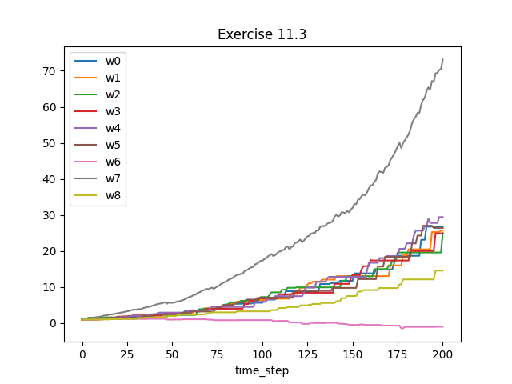
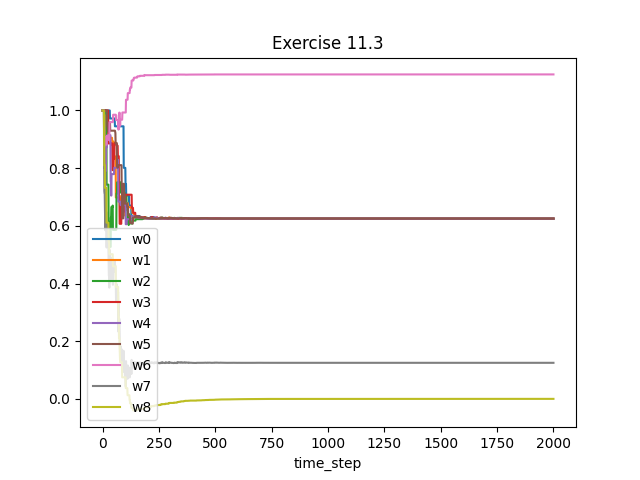

## Exercise 11.1
*Convert the equation of n-step off-policy TD (7.9) to semi-gradient form.
Give accompanying definitions of the return for both the episodic and continuing cases.*

$w_{t+n} = w_{t+n-1} + \alpha \rho_{t+1} ... \rho_{t+n-1} \delta_t \triangledown \hat{v}(S_t,w_{t+n-1})$

episodic case

$\delta_t = R_{t+1} + ... + \gamma^{n-1}R_{t+n} + \gamma^n \hat{v}(S_{t+n},w_{t+n-1}) - \hat{v}(S_t, w_{t+n-1})$

continuing case

$\delta_t = R_{t+1} - \bar{R}_t ... + R_{t+n} - \bar{R}_{t+n-1} + \hat{v}(S_{t+n},w_{t+n-1}) - \hat{v}(S_t, w_{t+n-1})$

## Exercise 11.2
*Convert the equations of n-step $Q(\sigma)$ (7.11 and 7.17) to semi-gradient
form. Give definitions that cover both the episodic and continuing cases.*

The update to weights is the same for semi-gradient $Q(\sigma)$ and semi-gradient sarsa

$w_{t+n} = w_t + \alpha[G_{t:t+n} - \hat{Q}_{t+n-1}(S_t,A_t,w_{t+n-1})] \triangledown \hat{Q}(S_t,A_t,w_{t+n-1})$

episodic case

$G_{t:t+n} = R_{t+1} + \gamma(\sigma_{t+1}\rho{t+1} + (1-\sigma_{t+1})\pi(A_{t+1}|S_{t+1}))(G_{t+1:t+n} - Q_{h-1}(S_{t+1},A_{t+1})) + \gamma \bar{V}_{t+n-1}(S_{t+1})$

continuing case

$G_{t:t+n} = R_{t+1} - \bar{R}_t + (\sigma_{t+1}\rho{t+1} + (1-\sigma_{t+1})\pi(A_{t+1}|S_{t+1}))(G_{t+1:t+n} - Q_{h-1}(S_{t+1},A_{t+1})) + \bar{V}_{t+n-1}(S_{t+1})$

## Exercise 11.3
*(programming) Apply one-step semi-gradient Q-learning to Baird’s counterexample and show empirically that its weights diverge*

Here is our example with off policy semi-gradient q-learning. We can clearly see the weights diverge to negative and positive infinity. Note the scale on the top left of the figure.

Code is in baird.py

What's interesting is if we treat this problem as a continuous problem by having no discount rate and $r-\bar{r}$ we do see the weights converge. The values all converge to the same value too. This is consistent with what we learned earlier about the differential values converging to a value that has an arbitrary offset.

