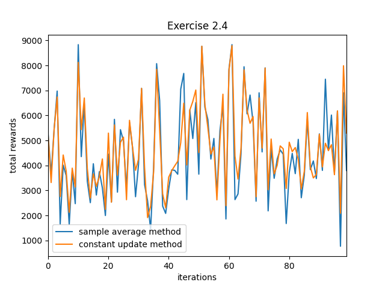
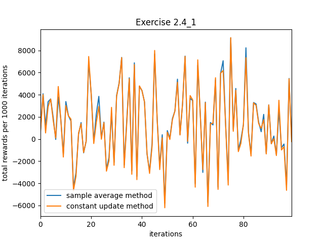

# Chapter 2

## Exercise 2.1
*In the comparison shown in Figure 2.1, which method will
perform best in the long run in terms of cumulative reward and cumulative
probability of selecting the best action? How much better will it be? Express
your answer quantitatively.*


These are the cumulative average rewards of running an agents with given epsilon values over 2000 steps.

Epsilon of 0 looks as if it will have the smallest value while epsilon 0.01 looks like it will have the greatest. Although 0.01 starts off worse than 0.1, once it eventually discovers the optimal policy through its slow exploration, it begins to exploit it more than 0.1 would resulting in a greater cumulative reward.

It seems that 0.01 will have the greatest cumulative reward.

## Exercise 2.2
*Give pseudocode for a complete algorithm for the n-armed
bandit problem. Use greedy action selection and incremental computation of
action values with α = 1/k step-size parameter. Assume a function bandit(a) that takes an action and returns a reward. Use arrays and variables; do not subscript anything by the time index t (for examples of this style of pseudocode, see Figures 4.1 and 4.3). Indicate how the action values are initialized
and updated after each reward. Indicate how the step-size parameters are set
for each action as a function of how many times it has been tried.*


```
Initialize policy map p_map of length n to val_init (default 0.0)
Set k map = [1.0 array of length n]
Repeat while playing:
    arm = argmax(p_map)
    reward = bandit(arm)
    Set k_map[arm] <- k map[arm] + 1.0
    p_map[arm] <- p_map[arm] + (1.0/k_map[arm] * (reward - p_map[arm]))
```

## Exercise 2.3
*If the step-size parameters, αk, are not constant, then the estimate Qk is a weighted average of previously received rewards with a weighting
different from that given by (2.6). What is the weighting on each prior reward
for the general case, analogous to (2.6), in terms of αk?*

Q<sub>k+1</sub> = Q<sub>k</sub> + &alpha;<sub>k</sub> * [R<sub>k</sub> - Q<sub>k</sub>]

= &alpha;<sub>k</sub>R<sub>k</sub> + (1 - &alpha;<sub>k</sub>) * Q<sub>k</sub>

= &alpha;<sub>k</sub>R<sub>k</sub> + (1 - &alpha;<sub>k</sub>) * [&alpha;<sub>k-1</sub>R<sub>k-1</sub> + (1 - &alpha;<sub>k-1</sub>) * Q<sub>k-1</sub>]
= &alpha;<sub>k</sub>R<sub>k</sub> + (1 - &alpha;<sub>k</sub>)&alpha;<sub>k-1</sub>R<sub>k-1</sub> + (1 - &alpha;<sub>k</sub>)(1 - &alpha;<sub>k-1</sub>) * Q<sub>k-1</sub>

= &alpha;<sub>k</sub>R<sub>k</sub> + (1 - &alpha;<sub>k</sub>)&alpha;<sub>k-1</sub>R<sub>k-1</sub> + (1 - &alpha;<sub>k</sub>)(1 - &alpha;<sub>k-1</sub>) * [&alpha;<sub>k-2</sub>R<sub>k-2</sub> + (1 - &alpha;<sub>k-2</sub>) * Q<sub>k-2</sub>]
= &alpha;<sub>k</sub>R<sub>k</sub> + (1 - &alpha;<sub>k</sub>)&alpha;<sub>k-1</sub>R<sub>k-1</sub> + (1 - &alpha;<sub>k</sub>)(1 - &alpha;<sub>k-1</sub>)&alpha;<sub>k-1</sub>R<sub>k-2</sub> + (1 - &alpha;<sub>k</sub>)(1 - &alpha;<sub>k-2</sub>)(1 - &alpha;<sub>k-2</sub>) * Q<sub>k-2</sub>

= $\alpha_{k}R_{k} + \sum_{i=1}^{k} [\alpha_{k-i}R_{k-i}\prod_{j=0}^{k-2}(1 - \alpha_{k-j})] + Q_{0}\prod_{j=0}^{k-1}(1 - \alpha_{k-j})$


## Exercise 2.4
*Design and conduct an experiment to demonstrate the difficulties that sample-average methods have for nonstationary
problems. Use a modified version of the 10-armed testbed in which all the
q(a) start out equal and then take independent random walks. Prepare plots
like Figure 2.1 for an action-value method using sample averages, incrementally computed by α = 1/k, and another action-value method using a constant
step-size parameter, α = 0.1. Use ε = 0.1 and, if necessary, runs longer than
1000 plays.*



These are the cumulative rewards of running the described experiment 100 times with 1000 iterations each.

```sample wins: 36 const wins: 60 ties: 4```

The reason I ran so many iterations of the experiment was because when I ran them independently, the results were inconsistent. However over a large number of trials the sample methods did worse than the constant method.

During the creation of this experiment it was discovered that the sample method performs beter than the constant method when every arm takes a random walk in the same direction. In other words, when the entire n-armed bandits takes a random walk. Here the bandit would move all distributions in the same direction with the same unit so the optimal actions are not changing. If the definition of nonstationary is strictly when optimal actions are changing then the constant methods perform better than sampled methods for n armed bandit. However, if simply having reward values change is considered nonstationary, then in this case there is an exception to that rule.



```sample wins: 75 const wins: 25 ties: 0```

The sample method will perform better than a constant problem where the entire environment changes in the same direction.

This is because if all the arms are moving in the same direction, then the optimal arm will not change.

I was curious what would happen if we made a bandit which had a random walk with dependent parts that did not all move in the same direction, but had some sort of alternating rule where if one went up, the other went down, making them dependent on each other.. So I did one with an alternating random walk where each arm would do the opposite direction of the previous.


```sample wins: 31 const wins: 63 ties: 6```

The result was consistent with the first experiment. Thus, we can see that the constant update method performs better for a nonstationary problem where the optimal arm is subject to change.

With a constant method old rewards are weighed less than new rewards. In sampling methods, the weight of each reward is equal. When the optimal arm to pick changes, it's difficult for the sampling method to take enough steps to make enough change to its policy to reflect this. As time goes on, the sampling method actually get worse at this. This is because as time goes on the new rewards have less weight.


## Exercise 2.5
*The results shown in Figure 2.2 should be quite reliable because they are averages over 2000 individual, randomly chosen 10-armed bandit tasks. Why, then, are there oscillations and spikes in the early part of
the curve for the optimistic method? What might make this method perform
particularly better or worse, on average, on particular early plays?*

The optimistic initial values are much larger than the actual values. Because the alpha value is only 0.1, it would take a large number of steps to bring the policy estimates down to accurate estimates. 

Over these time steps, the agent would bring the policy values of the less optimal arms down more than than the optimal arm. However, it would still end up performing a round-robin like policy. 

Let's consider a case where the optimal arm always returns 1 and the rest return -1. No matter what arm is tried first, the rest of the arms will have an estimated values larger than it so each policy will be tried at least once. After one round robin, the optimal value's policies would be `5 + 0.1 * (1 - 5) = 4.6` while the non optimal would be `5 + 0.1 * (-1 - 5) = 4.4`. It would exploit the optimal arm but then the non optimal arm's estimated values would be larger again, and then it would perform another round robin. This process will repeat, making the rewards oscillate from choosing each arm round robin.

The spikes occur when the estimated values get closer to the actual values. Eventually the round robin would start guessing the optimal arm "x times" instead of once before nuking is value low enough to try all the other values and returning to oscillation. This creates a "spike" in the rewards.

It would take more steps exploiting the optimal action before its estimated value drops lower than suboptimal estimates because the updates to its estimate would be be smaller. The updates to its estimate would be smaller because the difference between the estimate value and actual value is smaller.

When the distribution of actual values have little variance, the agent would receive more cumulative reward on early round because the agent ends up performing a round robin-like pattern.

## Exercise 2.6
*Suppose you face a binary bandit task whose true action values change randomly from play to play. Specifically, suppose that for any play the true values of actions 1 and 2 are respectively 0.1 and 0.2 with probability 0.5
(case A), and 0.9 and 0.8 with probability 0.5 (case B). If you are not able to
tell which case you face at any play, what is the best expectation of success
you can achieve and how should you behave to achieve it? Now suppose that
on each play you are told if you are facing case A or case B (although you still
don’t know the true action values). This is an associative search task. What
is the best expectation of success you can achieve in this task, and how should
you behave to achieve it?*

The best expectation would be a cumulative value of 0.5*t where t is the number of steps.

This is because `0.5*(0.1) + 0.5*(0.9) = 0.5` and `0.5*(0.2) + 0.5*(0.8) = 0.5`. The expected value of playing either move is 0.5. Thus, no matter what combination of moves you play overall, the expected value is 0.5.

When the agent knows if its case A or B:

Assuming that you run the task until you get an estimate for each action per task, then the best case you can achieve would be:
`0.5 * (0.9 + 0.2) = 0.55`. So the best case expected value is 0.55*t when the agent chooses greedily.

To get this you should have two policy maps for each case you are facing and perform a standard, mostly greedy agent on both tasks. It would make sense to set initial exploration to 0.5, and to diminish exploration to 0 over time because this is a stationary task.
