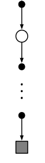
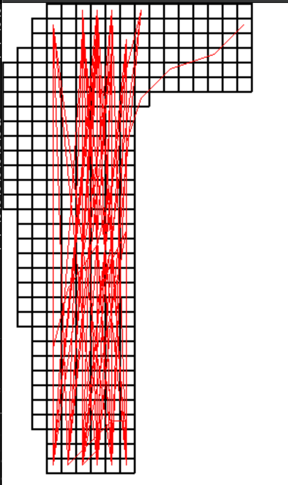
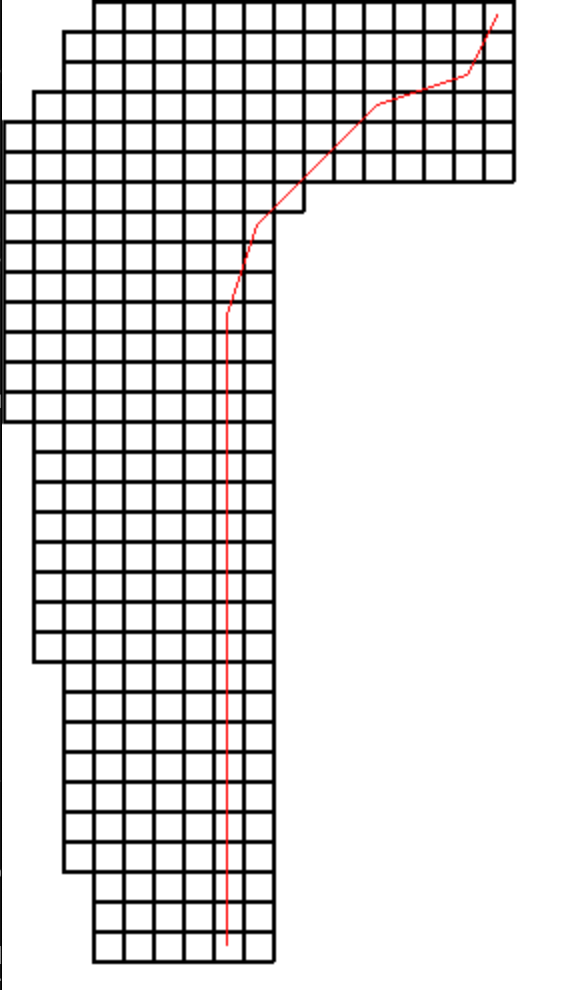
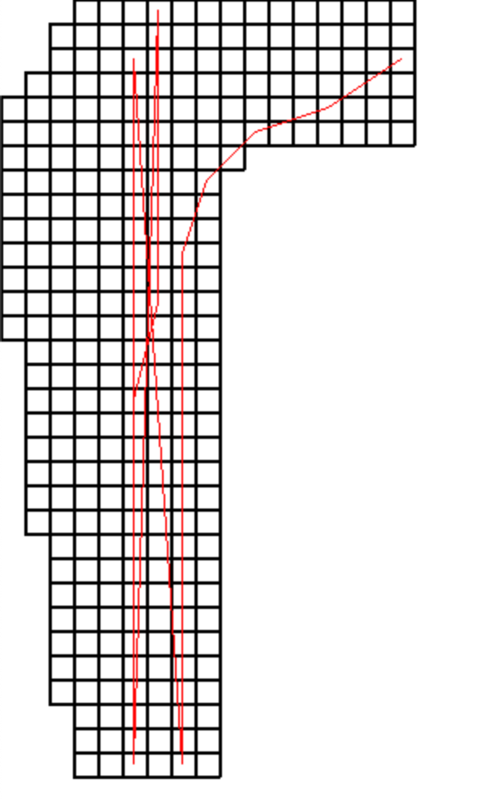

## Exercise 5.1
*Consider the diagrams on the right in Figure 5.1. Why does the estimated
value function jump up for the last two rows in the rear? Why does it drop for the
whole last row on the left? Why are the frontmost values higher in the upper diagrams
than in the lower?*

It jumps up for the last two rows because of the policy that these values are based on. The policy hits for any states other than 20 and 21 so the risk of losing is about the same for anything less than 20 or 21. The chance of winning on a stay from 20 is still good but not as good as 21 since 21 is a gauranteed win or tie.

The whole last row dropping, I suppose is because the dealer has an Ace so the projected values are lower since having an ace allows the dealer more opportunity to win since it can be counted as a 1 or an 11.

The frontmost values are higher in the upper diagram because the person still has a useable ace so there is less chance to bust.

## Exercise 5.2
*Suppose every-visit MC was used instead of first-visit MC on the blackjack
task. Would you expect the results to be very di↵erent? Why or why not?*

No I'd expect the results to be identical because in a single episode of blackjack, a state cannot be visited more than once due to the nature of blackjack.

## Exercise 5.3
*What is the backup diagram for Monte Carlo estimation of q⇡?*

It's nearly identical to the backup diagram of v pi except the base is at the (s,a) and ending at the action that leads to a terminal node.



## Exercise 5.4
*The pseudocode for Monte Carlo ES is inecient because, for each state–
action pair, it maintains a list of all returns and repeatedly calculates their mean. It would
be more ecient to use techniques similar to those explained in Section 2.4 to maintain
just the mean and a count (for each state–action pair) and update them incrementally.
Describe how the pseudocode would be altered to achieve this.*

Similiar to in section 2.4 we may simply keep track of the number of samples, and keep a running value for Q(s,a).

```
Initialize Ks(s,a) to 0 for all s in S and a in A
...
Ks(St, At) <- Ks(St, At) + 1
Q(St, At) <- Q(St, At) + 1/k * (G - Q(St,At))
```

## Exercise 5.5
*Consider an MDP with a single nonterminal state and a single action
that transitions back to the nonterminal state with probability p and transitions to the
terminal state with probability 1-p. Let the reward be +1 on all transitions, and let
 = 1. Suppose you observe one episode that lasts 10 steps, with a return of 10. What
are the first-visit and every-visit estimators of the value of the nonterminal state?*

The first visit estimator would have a value of 10 for a +1 return on each of the 10 steps with no discounting.

The every-visit estimators would have values of: 10,9,...,1. In other words T-t where t is the time step and T is the last state.
The estimator would be 1/10 * (10 + 9 + ... + 1) = 5.5

## Exercise 5.6
*What is the equation analogous to (5.6) for action values Q(s, a) instead of
state values V (s), again given returns generated using b?*

Q(s,a) = $\sum_{t\in{T(s,a)}}pt:T(t)-1*Gt$ / $\sum_{t\in{T(s,a)}}pt:T(t)-1$

Where $t\in{T(s,a)}$ is its first visits to state s where action a was selected.

## Exercise 5.7
*In learning curves such as those shown in Figure 5.3 error generally decreases
with training, as indeed happened for the ordinary importance-sampling method. But for
the weighted importance-sampling method error first increased and then decreased. Why
do you think this happened?*

At the start of training with weighted importance-sampling most of the values will be identical to the off policy values since this is its behavior for states that only occur once, so it may move the values in faulty directions depending on the initial values. However, after more episodes, the weighting allows the sampling method to more accurately predict the values for its target policy.

## Exercise 5.8
*The results with Example 5.5 and shown in Figure 5.4 used a first-visit MC
method. Suppose that instead an every-visit MC method was used on the same problem.
Would the variance of the estimator still be infinite? Why or why not?*

Yes, the estimator would still be infinite because for this problem and we can use the same expected values for variance as demonstrated in the text. This is because the importance-sampling ratio values are based on a state's subsequent state-action trajectory. The probability of a specific return value is equivalent to the chance at any given non terminal state that the following episode is of length k. We use the same formulation because the chance of a path following a non terminal state being length k is identical to the chance of a length k episode. The policy ratio is the same as a length k episode's policy value since it's based on the subsequent state-action trajectory.

## Exercise 5.9
*Modify the algorithm for first-visit MC policy evaluation (Section 5.1) to
use the incremental implementation for sample averages described in Section 2.4.*


```
Unless St appears in S0, S1,...,St1:
    Returns(St) <- Returns(St) + 1/k * (G - Returns(St,At))
    V(St) <- Returns(St)
```


## Exercise 5.10
*Derive the weighted-average update rule (5.8) from (5.7). Follow the
pattern of the derivation of the unweighted rule (2.3).*

$v_n = \frac{\sum^{n-1}{w_kg_k}}{\sum^{n-1}{w_k}}$

$v_n = \frac{\sum^{n-1}{w_kg_k}}{\sum^{n-2}{w_k}} * \frac{\sum^{n-2}{w_k}}{\sum^{n-1}{w_k}}$

$v_n = \frac{w_{n-1}g_{n-1} + \sum^{n-2}{w_kg_k}}{\sum^{n-2}{w_k}} * \frac{\sum^{n-2}{w_k}}{\sum^{n-1}{w_k}}$

$v_n = ( \frac{w_{n-1}g_{n-1}}{\sum^{n-2}{w_k}} + \frac{\sum^{n-2}{w_kg_k}}{\sum^{n-2}{w_k}} )\frac{\sum^{n-2}{w_k}}{\sum^{n-1}{w_k}}$

$v_n = ( \frac{w_{n-1}g_{n-1}}{\sum^{n-2}{w_k}} + v_{n-1})\frac{\sum^{n-2}{w_k}}{\sum^{n-1}{w_k}}$

$v_n = ( \frac{w_{n-1}g_{n-1}}{c_{n-2}} + v_{n-1})\frac{c_{n-2}}{c_{n-1}}$

$v_n = \frac{w_{n-1}g_{n-1}}{c_{n-1}} + \frac{v_{n-1}c_{n-2}}{c_{n-1}}$

$v_n = v_{n-1} + \frac{w_{n-1}g_{n-1}}{c_{n-1}} + \frac{v_{n-1}c_{n-2}}{c_{n-1}} - v_{n-1}$

$v_n = v_{n-1} + \frac{w_{n-1}g_{n-1}}{c_{n-1}} + \frac{v_{n-1}c_{n-2} - v_{n-1}c_{n_1}}{c_{n-1}}$

$v_n = v_{n-1} + \frac{w_{n-1}g_{n-1}}{c_{n-1}} + \frac{-v_{n-1}w_{n-1}}{c_{n-1}}$

$v_n = v_{n-1} + \frac{w_{n-1}}{c_{n-1}}(g_{n-1} - v_{n-1})$

## Exercise 5.11
*In the boxed algorithm for off-policy MC control, you may have been
expecting the W update to have involved the importance-sampling ratio pi(At|St)/b(At|St) , but instead it involves 1/b(At|St) . Why is this nevertheless correct?*

Because the weight is only updated if $A_t != \pi(S_t)$. In this case, since the action is the optimal action, the policy \pi will choose it with probability 1, otherwise it will choose it with probability 0 and that's why we exit the episode. Thus, 1/b(At|St) is correct.

## Exercise 5.12
*Racetrack (programming) Consider driving a race car around a turn
like those shown in Figure 5.5. You want to go as fast as possible, but not so fast as
to run o↵ the track. In our simplified racetrack, the car is at one of a discrete set of
grid positions, the cells in the diagram. The velocity is also discrete, a number of grid
cells moved horizontally and vertically per time step. The actions are increments to the
velocity components. Each may be changed by +1, 1, or 0 in each step, for a total of
nine (3 ⇥ 3) actions. Both velocity components are restricted to be nonnegative and less
than 5, and they cannot both be zero except at the starting line. Each episode begins
in one of the randomly selected start states with both velocity components zero and
ends when the car crosses the finish line. The rewards are 1 for each step until the car
crosses the finish line. If the car hits the track boundary, it is moved back to a random
position on the starting line, both velocity components are reduced to zero, and the
episode continues. Before updating the car’s location at each time step, check to see if
the projected path of the car intersects the track boundary. If it intersects the finish line,
the episode ends; if it intersects anywhere else, the car is considered to have hit the track
boundary and is sent back to the starting line. To make the task more challenging, with
probability 0.1 at each time step the velocity increments are both zero, independently of
the intended increments. Apply a Monte Carlo control method to this task to compute
the optimal policy from each starting state. Exhibit several trajectories following the
optimal policy (but turn the noise o↵ for these trajectories).*


Optimal path after 1,000 episodes



Optimal path after 20,000 episodes



Optimal path after 20,000 episodes from another starting point




## Exercise 5.13
*Show the steps to derive (5.14) from (5.12).*

$E[p_{t:T-1}R_{t+1}] = E[\frac{\pi(A_{t}|S_{t})}{b(A_{t}|S_{t})}\frac{\pi(A_{t+1}|S_{t+1})}{b(A_{t+1}|S_{t+1})}...\frac{\pi(A_{T-1}|S_{T-1})}{b(A_{T-1}|S_{T-1})}R_{t+1}]$

$= E[\frac{\pi(A_{t}|S_{t})}{b(A_{t}|S_{t})}]E[\frac{\pi(A_{t+1}|S_{t+1})}{b(A_{t+1}|S_{t+1})}]...E[\frac{\pi(A_{T-1}|S_{T-1})}{b(A_{T-1}|S_{T-1})}]R_{t+1}$

$= E[\frac{\pi(A_{t}|S_{t})}{b(A_{t}|S_{t})}]*1...*1*R_{t+1}$

$= E[\frac{\pi(A_{t}|S_{t})}{b(A_{t}|S_{t})}R_{t+1}]$

$= E[p_{t:t}R_{t+1}]$

## Exercise 5.14
*Modify the algorithm for o↵-policy Monte Carlo control (page 111) to use
the idea of the truncated weighted-average estimator (5.10). Note that you will first need
to convert this equation to action values.*


