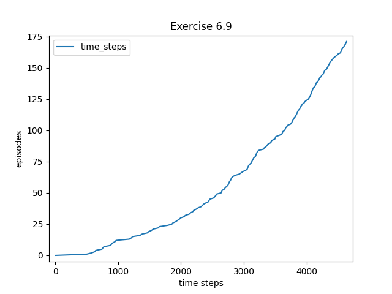

# Chapter 6 - Temporal-Difference Learning

## Exercise 6.1
*If V changes during the episode, then (6.6) only holds approximately; what
would the difference be between the two sides? Let Vt denote the array of state values
used at time t in the TD error (6.5) and in the TD update (6.2). Redo the derivation
above to determine the additional amount that must be added to the sum of TD errors
in order to equal the Monte Carlo error.*

$G_t-V(S_t)=R_{t+1}+\gamma G_{t+1}-V_t(S_t)+\gamma V_t(S_{t+1}) - \gamma V_t(S_{t+1})$

$= \delta_t + \gamma(G_{t+1} - V_t(S_{t+1}))$

$= \delta_t + \gamma(R_{t+2} + \gamma G_{t+2} - (V_{t+1}(S_{t+1}) + (V_{0}(S_{t+1}) - V_{t+1}(S_{t+1}))))$

$= \delta_t + \gamma(R_{t+2} + \gamma G_{t+2} - V_{t+1}(S_{t+1}) - V_{0}(S_{t+1}) + V_{t+1}(S_{t+1}))$

$= \delta_t + \gamma(R_{t+2} + \gamma G_{t+2} - V_{t+1}(S_{t+1}) - V_{0}(S_{t+1}) + V_{t+1}(S_{t+1}) + \gamma V_{t+1}(S_{t+2}) + \gamma V_{0}(S_{t+2}) - \gamma V_{t+1}(S_{t+2}) - (\gamma V_{t_1}(S_{t+2}) + (\gamma V_{0}(S_{t+2}) - \gamma V_{t+1}(S_{t+2}))))$

$= \delta_t + \gamma(R_{t+2} + \gamma V_{t+1}(S_{t+2}) - V_{t+1}(S_{t+1}) - V_{0}(S_{t+1}) + V_{t+1}(S_{t+1}) + \gamma V_{0}(S_{t+2}) - \gamma V_{t+1}(S_{t+2}) + \gamma G_{t+2} - (\gamma V_{t_1}(S_{t+2}) + (\gamma V_{0}(S_{t+2}) - \gamma V_{t+1}(S_{t+2}))))$

Define $d_t = - V_{0}(S_{t}) + V_{t}(S_{t}) + \gamma V_{0}(S_{t+1}) - \gamma V_{t}(S_{t+1})$

$= \delta_t + \gamma(\delta_{t+1} + d_t + \gamma G_{t+2} - (\gamma V_{t_1}(S_{t+2}) + (\gamma V_{0}(S_{t+2}) - \gamma V_{t+1}(S_{t+2}))))$

$= \delta_t + \gamma\delta_{t+1} + \gamma d_t + \gamma^2 G_{t+2} - \gamma(\gamma V_{t_1}(S_{t+2}) + (\gamma V_{0}(S_{t+2}) - \gamma V_{t+1}(S_{t+2})))$

$= \delta_t + \gamma\delta_{t+1} + \gamma d_t + \gamma^2 \delta_{t+2 + \gamma^2 d_{t+1}} + ... + \gamma^{T-t-1}\delta_{T-1} + \gamma^{T-t-1}d_{T-1} + \gamma^{T-t}(0-0)$

$= \sum_{k=t}^{T-1}{\gamma^{k-t}\delta_{k}} + \sum_{k=t+1}^{T-1}{\gamma^{k-t}d_{k}}$

## Exercise 6.2
*This is an exercise to help develop your intuition about why TD methods
are often more efficient than Monte Carlo methods. Consider the driving home example
and how it is addressed by TD and Monte Carlo methods. Can you imagine a scenario
in which a TD update would be better on average than a Monte Carlo update? Give
an example scenario—a description of past experience and a current state—in which
you would expect the TD update to be better. Here’s a hint: Suppose you have lots
of experience driving home from work. Then you move to a new building and a new
parking lot (but you still enter the highway at the same place). Now you are starting
to learn predictions for the new building. Can you see why TD updates are likely to be
much better, at least initially, in this case? Might the same sort of thing happen in the
original scenario?*

In the case given by the hint, our value predictions from entering a highway to exiting logically should remain the same since we are entering it from the same place. When we start to learn predictions from the new building using TD Learning it should keep our value estimates for the highway the same while changing our value estimates from the parking lot to the highway, rather than treating the whole as a different problem. If we use MC Methods we don't take advantage of the value predictions we already have for the highway, and would be subject to a greater variance, variables that affect time after the highway would 'ebb' into the parking lot time and vice versa.

In the original scenario TD Learning would benefit learning speed by being able to isolate variances to the sub problems. If we think of the sub problems as time steps, our agent has more 'temporal' awareness of where variances are coming from with regard to the overall problem.

## Exercise 6.3
*From the results shown in the left graph of the random walk example it
appears that the first episode results in a change in only V (A). What does this tell you
about what happened on the first episode? Why was only the estimate for this one state
changed? By exactly how much was it changed?*

On the first episode the agent ended up going to the left. Only the estimate for V (A) changes because the updates are done on each step. Rewards are 0 and all values are the same so change would only occur on a step that incurs reward on the first run.

## Exercise 6.4
*The specific results shown in the right graph of the random walk example
are dependent on the value of the step-size parameter, $\alpha$. Do you think the conclusions
about which algorithm is better would be a↵ected if a wider range of ↵ values were used?
Is there a di↵erent, fixed value of $\alpha$ at which either algorithm would have performed
significantly better than shown? Why or why not?*

Assuming that MC used the same range of alpha values, it is possible that there is a different value that either algorithm could have performed better. Perhaps between the ranges of .1 and .05, TD-Learning could have performed better. We see a pattern, however, of a "sweet spot" for the alpha values so we know .05 is near optimal.

The conclusions of which algorithm is better is probably not affected by this since MC and TD-Learning's alpha values are used in a near identical way. Even though TD-learning only applies its alpha value to the immediate reward, the subsequent updates are compounding the alpha's multiplication the same way it would be done with a MC method.

## Exercise 6.5
*In the right graph of the random walk example, the RMS error of the
TD method seems to go down and then up again, particularly at high ↵’s. What could
have caused this? Do you think this always occurs, or might it be a function of how the
approximate value function was initialized?*

It could be a result of the initializations being close to optimal for V(C), it initially goes down as it updates those farther away from C which would be updated first, but then once it starts updating C it goes down because any changes to C would be making the error larger.

I don't believe this should always occur since we can expect fluctuations but an overall pattern of the error going down the back up is unusual, especially for high values of alpha, which indicates that it is due to a pattern in the updates.

## Exercise 6.6
*In Example 6.2 we stated that the true values for the random walk example
are 1/6 , 2/6 , 3/6 , 4/6 , and 5/6, for states A through E. Describe at least two different ways that
these could have been computed. Which would you guess we actually used? Why?*

One way would be to calculate the probability that at step N the agent has landed at the terminal state. One could create a function based on N to calculate this probability using a method similar to the one demonstrated here: http://galileo.phys.virginia.edu/classes/152.mf1i.spring02/RandomWalk.html and then estimate its pdf. Then, find the value of its integral as n approaches infinity.

Another way is to calculate is to calculate a 'tree' of probabilities by iterating over all possible paths. The tree would have the node being calculated for, and with 0.5 probability weighting for each of the two branches, it leads to its neighbor nodes. The probability would be a sum of the paths to its leaf nodes that result in leading to the right side. The deeper the tree, the more accurate the calculation. This tree has infinite depth so one would calculate it to a certain depth for each state then divide up half the remaining probabilities in proportion to their distance from the terminal state.

I would guess the way that you guys actually used was the second because it would take less time and due to the nature of how it is calculated, based on what we know about the problem, as long as one iterates deep enough into the tree, it would be just as accurate as going through the difficulties of the first method.

## Exercise 6.7
*Design an off policy version of the TD(0) update that can be used with
arbitrary target policy $\pi$ and covering behavior policy b, using at each step t the importance
sampling ratio pt:t (5.3).*

$V(S) <- V(S) + p_{t:t}[R + \gamma V(S') - V(S)]$

## Exercise 6.8

$G_t - Q(S_t,A_t) = R_{t+1} + \gamma G_{t+1} - Q(S_t,A_t) + \gamma Q(S_{t+1},A_{t+1}) - \gamma Q(S_{t+1},A_{t+1})$

$= \delta_t + \gamma (G_{t+1} + \gamma Q(S_{t+1},A_{t+1}))$

$= \delta_t + \gamma \delta_{t+1} + \gamma^2(G_{t+2} - Q(S_{t+2},A_{t+2}))$

$=\sum_{k=t}^{T-1}{\gamma^{k-t}\delta_k}$

## Exercise 6.9

## Exercise 6.10

## Exercise 6.11
*Why is Q-learning considered an off-policy control method?*

It is considered an off-policy control method because it's learning the value function for policy $\pi$* that is completely greedy from the actions of policy $pi$ which is only epsilon-greedy. It does this by performing the actions of an epsilon greedy policy, but basing its updates to Q with the next state-action pair being based on a completely greedy policy, taking advantage of the structure of a TD Q-based update rule to ensure that all action-states are updated while finding the values for the optimal policy in order to gaurantee convergence to the optimal policy. Very clever.

## Exercise 6.12
*Suppose action selection is greedy. Is Q-learning then exactly the same
algorithm as Sarsa? Will they make exactly the same action selections and weight
updates?*

Yes, then Q-learning would be the same as fully greedy Sarsa. The key difference is that action selection does not match the update rule.

## Exercise 6.13
*What are the update equations for Double Expected Sarsa with an
$\epsilon$-greedy target policy?*

$Q_1(S,A) <- Q_1(S,A) + \alpha(R + \gamma E[Q_2(S,A)])$

Where $E[Q_2(S,A)]$ is based on the $\epsilon$-greedy target policy.

## Exercise 6.14
*Describe how the task of Jack’s Car Rental (Example 4.2) could be
reformulated in terms of afterstates. Why, in terms of this specific task, would such a
reformulation be likely to speed convergence?*

Instead of basing it on action values as we did, we could base our values on the states that result from choosing actions. Then, we would choose actions based on the values of the resulting states since we know what immediate states occur- before the stochastic randomness occurs to them. This would speed up learning because state-action pairs that lead to the same initial state would be treated the same- as they should.
