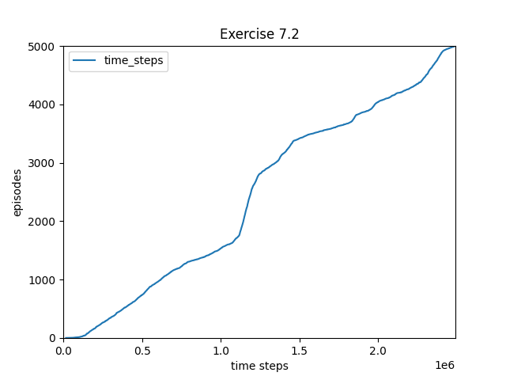
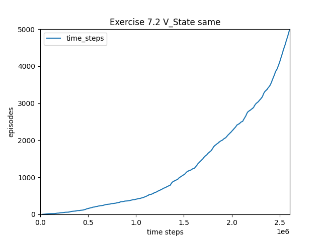

## Exercise 7.1
*In Chapter 6 we noted that the Monte Carlo error can be written as the
sum of TD errors (6.6) if the value estimates don’t change from step to step. Show that
the n-step error used in (7.2) can also be written as a sum TD errors (again if the value
estimates don’t change) generalizing the earlier result.*

The error factor for n-step return is:

$G_{t:t+n} - V_{t+n-1}(S_t)$

With the assumption that values don't change:

$G_{t:t+n} - V_(S_t)$

And the error factor for TD errors are:

$\delta_t = R_{t+1} + \gamma V(S_{t+1}) - V(S_{t})$

N-step return written as a sum of TD ErroerS:

$G_{t:t+n} - V(S_t) = R_{t+1} + \gamma R_{t+2} + ... + \gamma^{n-1}R_{t+n} + \gamma^{n}V(S_{t+n}) - V(S_t)$

Then using:

$R_{t+1} = R_{t+1} + \gamma V(S_{t+1}) - V(S_{t}) - \gamma V(S_{t+1}) + V(S_{t})$

$= R_{t+1} + \gamma V(S_{t+1}) - V(S_{t}) - \gamma V(S_{t+1}) + V(S_{t}) + \gamma R_{t+2} + ... + \gamma^{n-1}R_{t+n} + \gamma^{n}V(S_{t+n}) - V(S_t)$

$= \delta_t - \gamma V(S_{t+1}) + V(S_{t}) + \gamma R_{t+2} + ... + \gamma^{n-1}R_{t+n} + \gamma^{n}V(S_{t+n}) - V(S_t)$

$= \delta_t - \gamma V(S_{t+1}) + V(S_{t}) + \gamma[\delta_{t+1} - \gamma V(S_{t+2}) + V(S_{t+1})] + ... + \gamma^{n}[\delta_{t+n-1} - \gamma V(S_{t+n}) + V(S_{t+n-1})] +  \gamma^{n}V(S_{t+n}) - V(S_t)$

$= \sum_{k=t}^{t+n-1}{\gamma^{k-t}\delta_{k}} -\sum_{k=t}^{t+n-1}{\gamma^{k-t+1}V(S_{k+1})} + \sum_{k=t}^{t+n-1}{\gamma^{k-t}V(S_k)} + \gamma^{n}V(S_{t+n}) - V(S_t)$


$= \sum_{k=t}^{t+n-1}{\gamma^{k-t}\delta_{k}} - \sum_{k=t}^{t+n-2}{\gamma^{k-t+1}V(S_{k+1})} + \sum_{k=t+1}^{t+n-1}{\gamma^{k-t}V(S_k)}$

$= \sum_{k=t}^{t+n-1}{\gamma^{k-t}\delta_{k}} - \sum_{k=t+1}^{t+n-1}{\gamma^{k-t}V(S_{k})} + \sum_{k=t+1}^{t+n-1}{\gamma^{k-t}V(S_k)}$

$= \sum_{k=t}^{t+n-1}{\gamma^{k-t}\delta_{k}}$

## Exercise 7.2
*With an n-step method, the value estimates do change from
step to step, so an algorithm that used the sum of TD errors (see previous exercise) in
place of the error in (7.2) would actually be a slightly di↵erent algorithm. Would it be a
better algorithm or a worse one? Devise and program a small experiment to answer this
question empirically.*

For the experiment I decided to apply the n-step method to the racetrack problem with n=2.





Using the same value function as the time step of the value being updated does not perform better. It performs worse. This can be explaind with the error reduction property. Using the most recent values will be equivalent to using values closer to the true value, so it should speed up learning.

## Exercise 7.3
*Why do you think a larger random walk task (19 states instead of 5) was
used in the examples of this chapter? Would a smaller walk have shifted the advantage
to a di↵erent value of n? How about the change in left-side outcome from 0 to 1 made
in the larger walk? Do you think that made any di↵erence in the best value of n?*

A larger random walk task was used in order to be able to show a wider range of n values, to be able to understand the relationship between the value of n and performance more clearly.

Yes, a smaller walk would have shifted the advantage of n to a lower value of n. In the case of a smaller walk, larger values of n would shift improbable states farther from their true values. To show why, we should consider the example of 5 states with n=2 compared to n=3. In the case of n=2 states V(D) and V(E) are shifted closer to the value of 1 from 0.5 as they should be. In the case of n=3, V(D), V(E) and V(C) are all shifted when V(C) is already at its true value, causing V(C) to have a greater value than it should. Especially in this case without discounting, we don't want the value of rewards to be carried so far with these smaller environments. However, if we had a larger environment, it would make sense to have an n value greater than 2 since we would not have the same problem.

I don't think shifting the left-side outcome from 0 to -1 made a difference in the best values of n because the states were all initiated to values of 0, rather than 0.5. The scales were all shifted to favor this. Perhaps having a wider range of rewards allows for larger n but I'm not sure why it would.


## Exercise 7.4
*Prove that the n-step return of Sarsa (7.4) can be written exactly in terms
of a novel TD error, as (7.6)*

$G_{t:t+n} = R_{t+1} + \gamma R_{t+2} + ... + \gamma^{n-1}R_{t+n} + \gamma^n Q_{t+n-1}(S_{t+n}, A_{t+n})$

----------

Assuming $n\ge 1$ and $0\le t < T-n$

$Q_{t-1} (S_t, A_t) + \sum_{k=t}^{t+n-1}{y^{k-t}[R_{k+1} + \gamma Q_k(S_{k+1},A_{k+1}) - Q_{k-1}(S_k,A_k)]}$

$= Q_{t-1} (S_t, A_t) + R_{t+1} + \gamma Q_t(S_{t+1},A_{t+1}) - Q_{t-1}(S_t,A_t) + \sum_{k=t+1}^{t+n-1}{y^{k-t}[R_{k+1} + \gamma Q_k(S_{k+1},A_{k+1}) - Q_{k-1}(S_k,A_k)]}$

$= R_{t+1} + \gamma Q_t(S_{t+1},A_{t+1}) + \sum_{k=t+1}^{t+n-1}{y^{k-t}[R_{k+1} + \gamma Q_k(S_{k+1},A_{k+1}) - Q_{k-1}(S_k,A_k)]}$

$= R_{t+1} + \gamma R_{t+2} + \gamma^2 Q_{t+1}(S_{t+2},A_{t+2}) + \sum_{k=t+2}^{t+n-1}{y^{k-t}[R_{k+1} + \gamma Q_k(S_{k+1},A_{k+1}) - Q_{k-1}(S_k,A_k)]}$

$= R_{t+1} + \gamma R_{t+2} + ... + \gamma^{n-1} R_{t+n} + \gamma^n Q_{t+n-1}(S_{t+n},A_{t+n}) = G_{t:t+n}$

## Exercise 7.5
*Write the pseudocode for the off-policy state-value prediction algorithm
described above.*

```
Off-policy per-decision n-step state-value prediction for estimating V~v_* or v_pi

Input: an arbitrary behavior policy b such that b(a|s) > 0 for all s in S, a in A
Initialize V(s) arbitrarily, for all s in S
Initialize pi to be greedy with respect to Q, or as a fixed given policy
Algorithm parameters: step size a in (0,1], a positive integer n, dc_factor in (0,1)
All store and access operations (for St, At, and Rt) can take their index mod n+1

Define G_t_h
    Input: t, h, T
    Output: G_t:h value
    pt <- pi_(At|St)/b(At|St)
    If t-1 == T:
        return R_T
    If t == h:
        Return V(Sh)
    Else:
        Return pt * (R_t+1 + dc_factor * G_t_h(t+1, h)) + (1 - pt)* V(St)

Loop for each episode:
    Initialize and store S0 != terminal
    T <- infinity
    Loop for t = 0,1,2,...:
        if t < T then:
            Select and store action At according to policy b(.|St)
            Take action At
            Observe and store the next reward as Rt+1 and the next state as St+1
            If St+1 is terminal, then T <- t + 1
        update_index = t - n + 1
        if update_index >= 0
            G <- G_t_h(update_index, min(update_index + n, T), T)
            V(S_update_index) <- V(S_update_index) + alpha * [G - V(S_update_index)]
            If pi is being learned, then ensure that pi(.|S_update_index) is greedy wrt Q and V
    Until update_index = T - 1
```

## Exercise 7.6
*Prove that the control variate in the above equations does not change the
expected value of the return.*

$G_{t:h} = R_{t+1} + \gamma (p_{t+1}G_{t+1:h} + V_{h-1}^{-}(S_{t+1}) - p_{t+1}Q_{h-1}(S_{t+1},A_{t+1}))$

$E[G_{t:h}] = E[R_{t+1} + \gamma (p_{t+1}G_{t+1:h} + V_{h-1}^{-}(S_{t+1}) - p_{t+1}Q_{h-1}(S_{t+1},A_{t+1}))]$

$= R_{t+1} + \gamma E[(p_{t+1}G_{t+1:h} + V_{h-1}^{-}(S_{t+1}) - p_{t+1}Q_{h-1}(S_{t+1},A_{t+1}))]$


$= R_{t+1} + \gamma (E[(p_{t+1}G_{t+1:h}] + E[V_{h-1}^{-}(S_{t+1})] - E[p_{t+1}Q_{h-1}(S_{t+1},A_{t+1}))])$

Since $E[p_t] = 1$ and $E[V_{h-1}^{-}(S_{t+1})] = V_{h-1}^{-}(S_{t+1})$

$= R_{t+1} + \gamma (E[(G_{t+1:h}] + V_{h-1}^{-}(S_{t+1}) - E[Q_{h-1}(S_{t+1},A_{t+1}))])$

Since $V_{h-1}^{-}(S_{t+1}) = E[Q_{h-1}(S_{t+1},A_{t+1}))])$

$= R_{t+1} + \gamma (E[(G_{t+1:h}]$

$E[G_{t:h}]= R_{t+1} + \gamma (E[(G_{t+1:h}]$

$E[G_{t:h}]= E[G_{t:h}]$

Thus, we see that the control variate does not change the expected value of the return.

## Exercise 7.7
*Write the pseudocode for the off-policy action-value prediction algorithm
described immediately above. Pay particular attention to the termination conditions for
the recursion upon hitting the horizon or the end of episode.*

```
off-policy action-value prediction for estimating Q~q_* or q_pi

Input: an arbitrary behavior policy b such that b(a|s) > 0 for all s in S and a in A
Initialize Q(s,a) arbitrarily for all s in S, a in A
Initialize pi to be greedy wrt to Q, or as a fixed given policy
Algorithm parameters: step size alpha in (0,1], a positive integer n, dc_factor in (0,1)
All store and access operations (for St, At, and Rt) can take their index mod n + 1

Define G_h_t
    Input h, t, T
    Output: G_t:h value
    pt+1 <- pi_(At+1|St+1)/b(At+1|St+1)
    If t+1 == T:
        Return R_T
    If t == h:
        Return Q(St,At)
    Else:
        Return R_t+1 + dc_factor * (pt+1 * G_h_t(t+1,h,T) + SUM(pi(At+1|St+1)*Q(St+1,a) for all a in A) - pt+1*Q(St+1,At+1))

Loop for each episode:
    Initialize and store S0 != terminal
    Select and store an action A0 ~ b(.|S0)
    T <- infinity
    Loop for t = 0,1,2,...:
        Ff t < T then:
            Take action At
            Observe and store the next reward as Rt+1, next state as St+1
            If St+1 is terminal, then:
                T <- t + 1
            Else:
                Select and store an action A_t+1 ~ B(.|St+1)
        update_index = t - n + 1
        If update_index >= 0:
            G <- G_h_t(update_index, min(update_index + n, T), T)
            Q(S_update_index, A_update_index) = Q(S_update_index, A_update_index) + alpha * [G - Q(S_update_index, A_update_index]
            If pi is being learned, then ensure that pi(.|S_update_index) us greedt wrt Q
    Until update_index = T-1
```

## Exercise 7.8
*Show that the general (off-policy) version of the n-step return (7.13) can
still be written exactly and compactly as the sum of state-based TD errors (6.5) if the
approximate state value function does not change.*

Here are our identities:

$G_{t:h} = p_t(R_{t+1} + \gamma G_{t+1:h}) + (1-p_t) V(S_t)$

$\delta_t = R_{t+1} + \gamma V(S_{t+1}) - V(S_t)$

Expand $G_{t:h}$

$G_{t:h} = p_t(R_{t+1} + \gamma (p_{t+1}(R_{t+2} + \gamma G_{t+2:h}) + (1-p_{t+1}) V(S_{t+1})) + (1-p_t) V(S_t)$

$= p_tR_{t+1} + p_t \gamma (p_{t+1} R_{t+2} + p_{t+1} \gamma G_{t+2:h}) + V(S_{t+1}) - p_{t+1} V(S_{t+1})) + V(S_t) - p_tV(S_t)$

$= p_t( R_{t+1} + \gamma V(S_{t+1}) - V(S_t) \gamma (p_{t+1} R_{t+2} + p_{t+1} \gamma G_{t+2:h}) - p_{t+1} V(S_{t+1})) + V(S_t)$

$= p_t( \delta_t + p_{t+1} \gamma (R_{t+2} + \gamma G_{t+2:h} - V(S_{t+1}))) + V(S_t)$

$= p_t \delta_t + p_t p_{t+1} \gamma (R_{t+2} + \gamma G_{t+2:h} - V(S_{t+1})) + V(S_t)$

Expand again:

$= p_t \delta_t + p_t p_{t+1} \gamma (R_{t+2} + \gamma ( p_{t+2}(R_{t+3} + \gamma G_{t+3:h}) + (1-p_{t+2}) V(S_{t+2})) - V(S_{t+1})) + V(S_t)$

$= p_t \delta_t + p_t p_{t+1} \gamma (R_{t+2} + \gamma V(S_{t+2}) - V(S_{t+1}) + p_{t+2} \gamma ( R_{t+3} + \gamma G_{t+3:h} - V(S_{t+2}) ) + V(S_t)$

$= p_t \delta_t + p_t p_{t+1} \gamma (\delta_{t+1} + p_{t+2} \gamma ( R_{t+3} + \gamma G_{t+3:h} - V(S_{t+2}) ) + V(S_t)$

$= p_t \delta_t + p_t p_{t+1} \gamma \delta_{t+1} + p_t p_{t+1} p_{t+2} \gamma^2 ( R_{t+3} + \gamma G_{t+3:h} - V(S_{t+2}) ) + V(S_t)$

There's a pattern!

$= p_t \delta_t + p_t p_{t+1} \gamma \delta_{t+1} + p_t p_{t+1} p_{t+2} \gamma^2 \delta_{t+2} + ... + \prod_{k=t}^{h}{p_{k}} * \gamma^{h-t}(R_{h} + \gamma G_{h:h} - V(S_{h-1})) + V(S_t)$

$= p_t \delta_t + p_t p_{t+1} \gamma \delta_{t+1} + p_t p_{t+1} p_{t+2} \gamma^2 \delta_{t+2} + ... + \prod_{k=t}^{h}{p_{k}} * \gamma^{h-t}(R_{h} + \gamma V(S_{h}) - V(S_{h-1})) + V(S_t)$

$= p_t \delta_t + p_t p_{t+1} \gamma \delta_{t+1} + p_t p_{t+1} p_{t+2} \gamma^2 \delta_{t+2} + ... + \prod_{k=t}^{h}{p_{k}} * \gamma^{h-t}\delta_h + V(S_t)$

$= (\sum_{k=t}^{h}{(\prod_{i=t}^{k}{p_k})\gamma^{k-t}\delta_k}) + V(S_t)$

## Exercise 7.9
*Repeat the above exercise for the action version of the off-policy n-step
return (7.14) and the Expected Sarsa TD error (the quantity in brackets in Equation 6.9).*

Here are our identities:

$G_{t:h} = R_{t+1} + p_{t+1} \gamma (G_{t+1:h} - Q(S_{t+1},A_{t+1})) + \gamma V^-(S_{t+1})$

$V^-(S_{t}) = \sum_{a}{\pi(a|S_t)Q(S_t,a)}$

$\delta_t = R_{t+1} + \gamma(\sum_{a}{\pi(a|S_{t+1})Q(S_{t+1},a)}) - Q(S_t,A_t)$

Replace $V^-(S_{t})$

$G_{t:h} = R_{t+1} + p_{t+1} \gamma (G_{t+1:h} - Q(S_{t+1},A_{t+1})) + \gamma \sum_{a}{\pi(a|S_t)Q(S_t,a)}$

$= R_{t+1} + \gamma \sum_{a}{\pi(a|S_t)Q(S_t,a)} + p_{t+1} \gamma (G_{t+1:h} - Q(S_{t+1},A_{t+1}))$

$= R_{t+1} + \gamma \sum_{a}{\pi(a|S_t)Q(S_t,a)} - Q(S_t,A_t) + Q(S_t,A_t) + p_{t+1} \gamma (G_{t+1:h} - Q(S_{t+1},A_{t+1}))$

Sub in our identity

$= \delta_t + p_{t+1} \gamma (G_{t+1:h} - Q(S_{t+1},A_{t+1})) + Q(S_t,A_t)$

Expand

$= \delta_t + p_{t+1} \gamma (R_{t+2} + p_{t+2} \gamma (G_{t+2:h} - Q(S_{t+2},A_{t+2})) + \gamma V^-(S_{t+2}) - Q(S_{t+1},A_{t+1})) + Q(S_t,A_t)$


$= \delta_t + p_{t+1} \gamma (R_{t+2} + p_{t+2} \gamma (G_{t+2:h} - Q(S_{t+2},A_{t+2})) + \gamma \sum_{a}{\pi(a|S_{t+2})Q(S_{t+2},a)} - Q(S_{t+1},A_{t+1})) + Q(S_t,A_t)$

$= \delta_t + p_{t+1} \gamma (R_{t+2} + \gamma \sum_{a}{\pi(a|S_{t+2})Q(S_{t+2},a)} - Q(S_{t+1},A_{t+1}) + p_{t+2} \gamma (G_{t+2:h} - Q(S_{t+2},A_{t+2}))) + Q(S_t,A_t)$

$= \delta_t + p_{t+1} \gamma (\delta_{t+1} + p_{t+2} \gamma (G_{t+2:h} - Q(S_{t+2},A_{t+2}))) + Q(S_t,A_t)$

$= \delta_t + p_{t+1} \gamma \delta_{t+1} + p_{t+1} p_{t+2} \gamma^2 (G_{t+2:h} - Q(S_{t+2},A_{t+2})) + Q(S_t,A_t)$

There's a pattern!

$= \delta_t + p_{t+1} \gamma \delta_{t+1} + p_{t+1} p_{t+2} \gamma^2 \delta_{t+2} + ... + p_{t+1}...p_{h-1}\gamma^{h-t-1}(G_{h-1:h} - Q(S_{h-1}, A_{h-1})) + Q(S_t,A_t)$

Expand

$= \delta_t + p_{t+1} \gamma \delta_{t+1} + p_{t+1} p_{t+2} \gamma^2 \delta_{t+2} + ... + p_{t+1}...p_{h-1}\gamma^{h-t-1}(R_{h} + p_{h} \gamma (G_{h:h} - Q(S_{h},A_{h})) + \gamma V^-(S_{h}) - Q(S_{h-1}, A_{h-1})) + Q(S_t,A_t)$

Remember:

$G_{h:h} = Q(S_h, A_h)$

Sub in our identities:

$= \delta_t + p_{t+1} \gamma \delta_{t+1} + p_{t+1} p_{t+2} \gamma^2 \delta_{t+2} + ... + p_{t+1}...p_{h-1}\gamma^{h-t-1}(R_{h} + p_{h} \gamma (Q(S_h, A_h) - Q(S_{h},A_{h})) + \gamma \sum_{a}{\pi(a|S_h)Q(S_h,a)} - Q(S_{h-1}, A_{h-1})) + Q(S_t,A_t)$

$= \delta_t + p_{t+1} \gamma \delta_{t+1} + p_{t+1} p_{t+2} \gamma^2 \delta_{t+2} + ... + p_{t+1}...p_{h-1}\gamma^{h-t-1}(R_{h} + \gamma \sum_{a}{\pi(a|S_h)Q(S_h,a)} - Q(S_{h-1}, A_{h-1})) + Q(S_t,A_t)$

$= \delta_t + p_{t+1} \gamma \delta_{t+1} + p_{t+1} p_{t+2} \gamma^2 \delta_{t+2} + ... + p_{t+1}...p_{h-1}\gamma^{h-t-1}\delta_{h-1} + Q(S_t,A_t)$

$G_{t:h} = \delta_t + (\sum_{k=t+1}^{h-1} (\prod_{t+1}^{k} p_k) \gamma^{k-t} \delta_k) + Q(S_t,A_t)$

## Exercise 7.10
*Devise a small off-policy prediction problem and use it to
show that the o↵-policy learning algorithm using (7.13) and (7.2) is more data ecient
than the simpler algorithm using (7.1) and (7.9).*

## Exercise 7.11
*Show that if the approximate action values are unchanging, then the
tree-backup return (7.16) can be written as a sum of expectation-based TD errors:*

Prove:

$G_{t:t+n} = Q(S_t,A_t) + \sum_{k=t}^{min(t+n-1,T-1)}{\delta_k \prod_{i=t+1}^{k}{\gamma \pi(A_i|S_i)}}$

Identities:

$V^-(S_{t}) = \sum_{a}{\pi(a|S_t)Q(S_t,a)}$

$\delta_t = R_{t+1} + \gamma(\sum_{a}{\pi(a|S_{t+1})Q(S_{t+1},a)}) - Q(S_t,A_t)$

$G_{t:t+n} = R_{t+1} + \gamma \sum_{a!=A_t}{\pi(a|S_{t+1})Q(S_{t+1},a)} + \gamma \pi(A_{t+1}, S_{t+1})G_{t+1:t+n}$

Proof

$G_{t:t+n} = R_{t+1} + \gamma \sum_{a!=A_t}{\pi(a|S_{t+1})Q(S_{t+1},a)} + \gamma \pi(A_{t+1}|S_{t+1})Q(S_{t+1}, A_{t+1}) - \gamma \pi(A_{t+1}|S_{t+1})Q(S_{t+1}, A_{t+1}) + Q(S_t, A_t) - Q(S_t, A_t) + \gamma \pi(A_{t+1}, S_{t+1})G_{t+1:t+n}$

$G_{t:t+n} = R_{t+1} + \gamma V^-(S_{t+1}) - Q(S_t, A_t) - \gamma \pi(A_{t+1}|S_{t+1})Q(S_{t+1}, A_{t+1}) + Q(S_t, A_t) + \gamma \pi(A_{t+1}, S_{t+1})G_{t+1:t+n}$

$G_{t:t+n} = \delta_t - \gamma \pi(A_{t+1}|S_{t+1})Q(S_{t+1}, A_{t+1}) + Q(S_t, A_t) + \gamma \pi(A_{t+1}| S_{t+1})G_{t+1:t+n}$

$G_{t:t+n} = \delta_t - \gamma \pi(A_{t+1}|S_{t+1})Q(S_{t+1}, A_{t+1}) + Q(S_t, A_t) + \gamma \pi(A_{t+1}| S_{t+1})(R_{t+2} + \gamma \sum_{a!=A_{t+1}}{\pi(a|S_{t+2})Q(S_{t+2},a)} + \gamma \pi(A_{t+2}, S_{t+2})G_{t+2:t+n})$

$G_{t:t+n} = \delta_t + Q(S_t, A_t) + \gamma \pi(A_{t+1}| S_{t+1})(R_{t+2} + \gamma \sum_{a!=A_{t+1}}{\pi(a|S_{t+2})Q(S_{t+2},a)} + \gamma \pi(A_{t+2}| S_{t+2})G_{t+2:t+n} - Q(S_{t+1}, A_{t+1}))$

$G_{t:t+n} = Q(S_t, A_t) + \delta_t + \gamma \pi(A_{t+1}| S_{t+1})(R_{t+2} + \gamma \sum_{a!=A_{t+1}}{\pi(a|S_{t+2})Q(S_{t+2},a)} + \gamma \pi(A_{t+2}|S_{t+2})Q(S_{t+2}, A_{t+2}) - \gamma \pi(A_{t+2}|S_{t+2})Q(S_{t+2}, A_{t+2}) - Q(S_{t+1}, A_{t+1}) + \gamma \pi(A_{t+2}| S_{t+2})G_{t+2:t+n})$

$G_{t:t+n} = Q(S_t, A_t) + \delta_t + \gamma \pi(A_{t+1}| S_{t+1})(R_{t+2} + \gamma V^-(S_{t+2}) - Q(S_{t+1}, A_{t+1}) - \gamma \pi(A_{t+2}|S_{t+2})Q(S_{t+2}, A_{t+2}) + \gamma \pi(A_{t+2}| S_{t+2})G_{t+2:t+n})$

$G_{t:t+n} = Q(S_t, A_t) + \delta_t + \gamma \pi(A_{t+1}| S_{t+1})(\delta_{t+1} - \gamma \pi(A_{t+2}|S_{t+2})Q(S_{t+2}, A_{t+2}) + \gamma \pi(A_{t+2}| S_{t+2})G_{t+2:t+n})$

$G_{t:t+n} = Q(S_t, A_t) + \delta_t + \pi(A_{t+1}| S_{t+1}) \gamma  \delta_{t+1} - \pi(A_{t+1}| S_{t+1}) \pi(A_{t+2}|S_{t+2}) \gamma^2 Q(S_{t+2}, A_{t+2}) + \pi(A_{t+1}| S_{t+1}) \pi(A_{t+2}| S_{t+2})\gamma^2G_{t+2:t+n}$

Recursion found!

$G_{t:t+n} = Q(S_t, A_t) + \delta_t + \pi(A_{t+1}| S_{t+1}) \gamma  \delta_{t+1} + \pi(A_{t+1}| S_{t+1}) \pi(A_{t+2}|S_{t+2}) \gamma^2\delta_{t+2} + ... + \prod_{k=t}^{t+n-2}{\pi(A_{k}|S_{k})} \gamma^{n-2} \delta_{t+n-1} - \prod_{k=t}^{t+n-1}{\pi(A_{k}|S_{k})} \gamma^{n-1} Q(S_{t+n-1}, A_{t+n-1}) + \prod_{k=t}^{t+n-1}{\pi(A_{k}|S_{k})} \gamma^{n-1}(G_{t+n-1:t+n})$

$G_{t:t+n} = Q(S_t, A_t) + \delta_t + \pi(A_{t+1}| S_{t+1}) \gamma  \delta_{t+1} + \pi(A_{t+1}| S_{t+1}) \pi(A_{t+2}|S_{t+2}) \gamma^2\delta_{t+2} + ... + \prod_{k=t}^{t+n-2}{\pi(A_{k}|S_{k})} \gamma^{n-2} \delta_{t+n-1} + \prod_{k=t}^{t+n-1}{\pi(A_{k}|S_{k})} \gamma^{n-1}(R_{t+n} + \gamma \sum_{a}{\pi(a|S_{t+n}) Q(S_{t+n}, a)} - Q(S_{t+n-1}, A_{t+n-1}))$

$G_{t:t+n} = Q(S_t, A_t) + \delta_t + \pi(A_{t+1}| S_{t+1}) \gamma  \delta_{t+1} + \pi(A_{t+1}| S_{t+1}) \pi(A_{t+2}|S_{t+2}) \gamma^2\delta_{t+2} + ... + \prod_{k=t}^{t+n-2}{\pi(A_{k}|S_{k})} \gamma^{n-2} \delta_{t+n-1} + \prod_{k=t}^{t+n-1}{\pi(A_{k}|S_{k})} \gamma^{n-1}\delta_{t+n-1}$

$G_{t:t+n} = Q(S_t,A_t) + \sum_{k=t}^{min(t+n-1,T-1)}{\delta_k \prod_{i=t+1}^{k}{\gamma \pi(A_i|S_i)}}$
