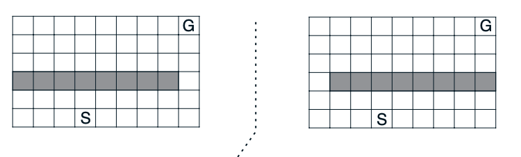
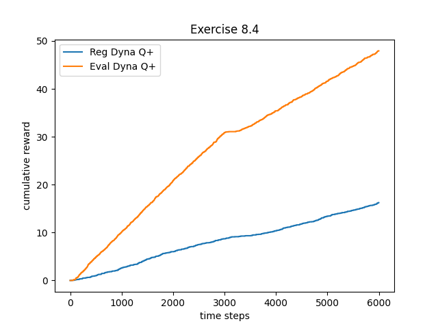
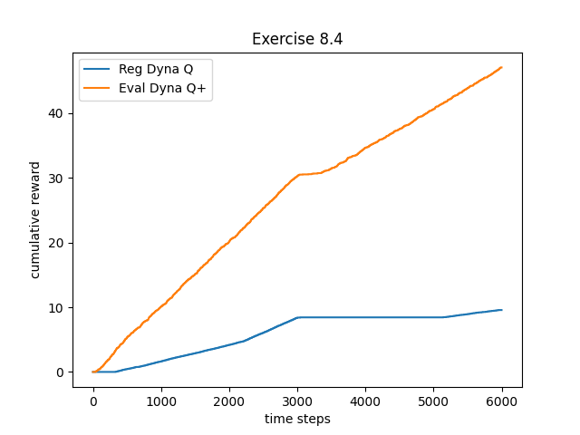
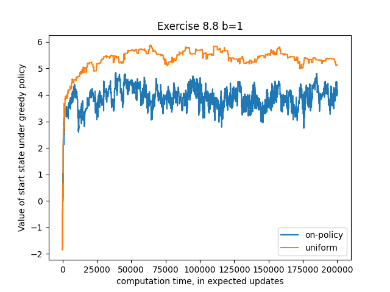

## Exercise 8.1
*The nonplanning method looks particularly poor in Figure 8.3 because it is a one-step method; a method using multi-step bootstrapping would do better. Do you
think one of the multi-step bootstrapping methods from Chapter 7 could do as well as
the Dyna method? Explain why or why not.*

In terms of pure episode to step ratio, a multi-step boostrapping method may not do as well as the dyna method, especially since the agent starts at random positions.

Although many states are updated with a multi-step boostrapping method, the result of which are updated and which direction the maximum Q values are updated to are based on the random path that's been taken. In the case of a Dyna method with n=50, after a single step a large area around the single learned path is updated. For almost 2/3 of the grid we have learned optimal paths to the goal.

However, there may be cases where this is not true depending on the state space. Dyna is great for this example due to the random nature of the agent's start point, and due to the states being in a grid. There may still yet be some specific problems that are exceptions. Perhaps, when it is very difficult to build a model from samples.

## Exercise 8.2
*Why did the Dyna agent with exploration bonus, Dyna-Q+, perform
better in the first phase as well as in the second phase of the blocking and shortcut
experiments?*

It performed better because the added reward of exploration (since reward give 0 base) helped it find the most optimal path in fewer episodes by having it perform almost a methodic "sweep" of S,A pairs close to the reward.

I would estimate, however, that in the long run, without the environment change, that the Dyna-Q+ would eventually lose its lead on the Dyna-Q, since the optimal path has already been found and Dyna-Q+ is simpy exporing more.

## Exercise 8.3
*Careful inspection of Figure 8.5 reveals that the difference between Dyna-Q+ and Dyna-Q narrowed slightly over the first part of the experiment. What is the reason
for this?*

This is because once Dyna-Q+ and Dyna-Q learn policies, exploratory moves would only cause Dyna-Q+ to lose its 'lead' on Dyna-Q. We see this starting to happen in the first stage.

## Exercise 8.4 (programming)
*The exploration bonus described above actually changes
the estimated values of states and actions. Is this necessary? Suppose the bonus 
p⌧ was used not in updates, but solely in action selection. That is, suppose the action selected was always that for which Q(St, a) + 
p⌧ (St, a) was maximal. Carry out a
gridworld experiment that tests and illustrates the strengths and weaknesses of this
alternate approach.*

I experimented using the example from the textbook of the gridworld scenario:



Except in reverse, where the optimal path was first.

(Switching at 1000 steps)

Using the following hyperparameters:

```
self.k = 0.075
self.alpha = 0.1
self.epsilon = 0.25
self.n = 50
self.discount_rate = 0.95
```





The results show that using the exploration bonus in choosing actions and not in updating Q-values resulted in better performance. The main difference between the two Dyna-Q+ methods would be that paths closest the actual paths taken by the policy would be weighed by their immediate "plus factors" and not be influenced by the random "plus factors" created in planning. Which state and action pairs were chosen to be updated would add to the variance and result in more random exploration.

## Exercise 8.5
*How might the tabular Dyna-Q algorithm shown on page 164 be modified
to handle stochastic environments? How might this modification perform poorly on
changing environments such as considered in this section? How could the algorithm be
modified to handle stochastic environments and changing environments?*

It could store all the R,S_prime pairs that it samples, keeping a fractional count of them and returning the R, S_prime based on the proportions. If two R, S_prime pairs are observed both 5 times then it should return each pair with 50% probability.

It would perform poorly on changing environments because the samples percentages would not adapt to the changing stochastic properties.

There are two ways of handling this. One way could be to only use samples taken within a certain time window, for example only samples within 100 time steps or only basing the model distribution off of the last k observed samples.

## Exercise 8.6
*The analysis above assumed that all of the b possible next states were
equally likely to occur. Suppose instead that the distribution was highly skewed, that
some of the b states were much more likely to occur than most. Would this strengthen or weaken the case for sample updates over expected updates? Support your answer.*

It is hard for me to answer in terms of the analysis where the error reduction is based on the term $\sqrt{\frac{b-1}{bt}}$ since I have no knowledge regarding its derivation.

I would assume that the factor of reduction would be larger when it is based on a skewed branch since a update based on the skewed branch would be more reflective of the overall value as it is more frequently occuring. In this case, then the effect may actually be greater.

In terms of use in a real problem, I believe that the effect of gaining more accurate value backups sooner would be multiplied. If the actual distribution is very much skewed then the difference in accuracy of the model's stochastic estimates from a few steps would be greater.

So I would say that overall, this would strengthen the case of sampled updates over expected updates.

## Exercise 8.7
*Some of the graphs in Figure 8.8 seem to be scalloped in their early portions,
particularly the upper graph for b = 1 and the uniform distribution. Why do you think
this is? What aspects of the data shown support your hypothesis?*

I believe the scallops are due to "back and forth" nature of GPI. As the values are more accurately represented, then the policy must be "tested" and refined. So the scallops are our agent improving by optimizing its policy to the found values, the estimated value for our start state increases as it does this. But when it goes and begins to exploit the paths for these optimal moves, it would discover that some are not as "great" as expected, lowering its value estimate. This process continues as it refines its estimates towards the true values.

## Exercise 8.8
*(programming) Replicate the experiment whose results are shown in the
lower part of Figure 8.8, then try the same experiment but with b = 3. Discuss the
meaning of your results.*


Unfortunately, I was unable to recreate the same results and my computer is not good enough to run b=3!

I may return to this.

