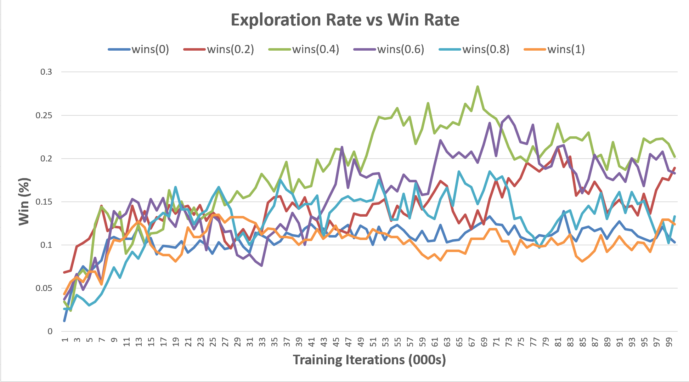
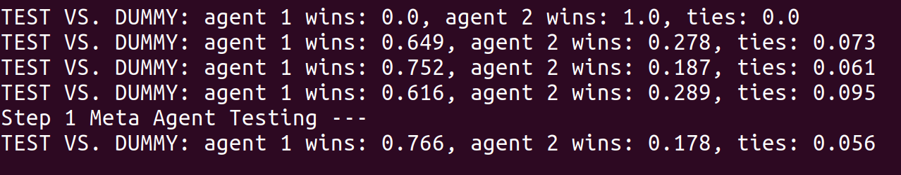
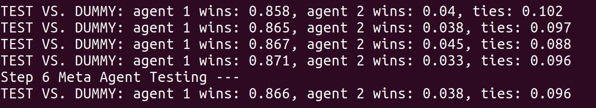

# Chapter 1: The Reinforcement Learning Problem

## Exercises

### Exercise 1.1: Self-Play
*Suppose, instead of playing against a random opponent, the reinforcement learning algorithm described above played against itself. What do you think would happen in this case? Would it learn a different way of playing?*

Yes, we think the agent would learn a different way of playing. We expect the self play agent to learn faster and for it to learn a more intelligent way of playing because it shares a policy map with its opponent, allowing it to learn from each other's mistakes and wins.

Here we compare the losses of agents that have trained vs. themselves (self play) and agents that have trained vs. a completely random agent. We test both types of agents at each step after 1000 training games against the current self-play agent, a completely random agent, and our meta agent which has been trained against both other agents and random agents to achieve a 90% win rate against random agents.

The self-play agent lost the least against itself and the random-trained agent performs best against random agents. This makes sense because these are what they have learned to play against. So this proves that they have learned different ways of playing.

It is difficult for us to say which agent has performed better because we are testing against a meta agent that has been trained primarily against a random agent. Also, we trained both with an exploration rate of 0.5. We think the self play agent may actually perform better with a lower exploration rate, because it would keep challenging its own learned optimizations against itself.

### Exercise 1.2: Symmetries
*Many tic-tac-toe states are really the same because of symmetries. How might we amend the reinforcement learning algorithm described above to take advantage of this? In what ways would this improve it? Now think again. Suppose the opponent did not take advantage of symmetries. In that case, should we? Is it true, then, that symmetrically equivalent positions should necessarily have the same value?*

When the agent updates a state's value in a policy, it should also update the state's symmetric states as well. There are two types of symmetries: rotational and mirrored, adding up to a total of 7 symmetric states per state.

This could improve our RL method by allowing agents to learn faster. An agent would not have to relearn the same estimates for two states that would otherwise be the same.

If the opponent does not take advantage of the symmetries, they would learn at a slower rate. Also, if a symmetrical-aware agent learns how to defeat the opponent with one strategy, it can easily defeat it in the same way, but with a symmetrical version. Thus, we should treat the symmetrical states equivalently.

Here we compare the performance of a symmetrically aware agent vs. a non symmetrically aware agent. Both have been trained against an agent that plays randomly, and tested against a random agent as well. The symmetrically aware agent wins at a greater rate much faster than the non symmetrically aware agent, and continues to have a higher win rate overall. However, theortically they should both converge to the same policies eventually. We can see this starting to happen near the end of the experiment.

### Exercise 1.3: Greedy Play
*Suppose the reinforcement learning player was greedy, that is, it always played the move that brought it to the position that it rated the best. Would it learn to play better, or worse, than a nongreedy player? What problems might occur?*

It may learn to play worse than a non greedy player, especially at the beginning of training. It's beneficial to have a high exploration vs. exploitation value when initially learning, because the agent needs to fill up its policy map's different states... Once an exploitive agent learns a few ways to win, it may stick to those potentially suboptimal moves and not explore to learn more optimal moves.

Here we compare agents which play with different exploration values. Each which converge because their alpha values reduce to 0 before the end of the experiment. The greedy agent, while at first performed quite well, converged to the second lowest of win rates. This agent learns very slowly. Theoretically if it did not converge it could be able to eventually perform as well as the others agents if it were to vs. another learning agent because its sub optimal moves would eventually decrease their values when they lead to losses against a more 'intelligent' agent.

### Exercise 1.4: Learning from Exploration
*Suppose learning updates occurred after all moves, including exploratory moves. If the step-size parameter is appropriately reduced over time, then the state values would converge to a set of probabilities. What are the two sets of probabilities computed when we do, and when we do not, learn from exploratory moves? Assuming that we do continue to make exploratory moves, which set of probabilities might be better to learn? Which would result in more wins?*

Here the greedy agent converges to a sub optimal set of probabilities when compared to most of the non greedy agents. It looks like the most optimal policy map lies somewhere between an agent with an exploration rate between 0.4 and 0.6. The agent with an exploration rate of 1, however learned the worst set of probabilities.

These have all been tested against a random agent with exploration = 0.0 . The set of probabilities from a balanced explorative agent leads to more wins than a fully greedy agent.

### Exercise 1.5: Other Improvements
*Can you think of other ways to improve the reinforcement learning player? Can you think of any better way to solve the tic-tac-toe problem as posed?*

One method we tried out was training multiple agents in parallel, and then combining their policies by taking the means of their probabilities. This combined agent, when tested, performed better than individual agents at the beginning of training. After longer training, however, it did not prove to gain higher than the best individual agent. This could still be used to accelerate training and take advantage of multi threaded processing.

Another way to improve the agent is to tune the hyperparameters: exploration, alpha, and the rate of decrease.

Other ways to perhaps solve the tic tac toe problem may be to train some kind of attention mechanism to focus on certain parts of the state, and to share those focused parts of the state with other probabilities. Some games may have "noise" in state, pieces played that are not important to the dominant strategy, that prevent two game states from being identical despite the opponent using the same strategy.